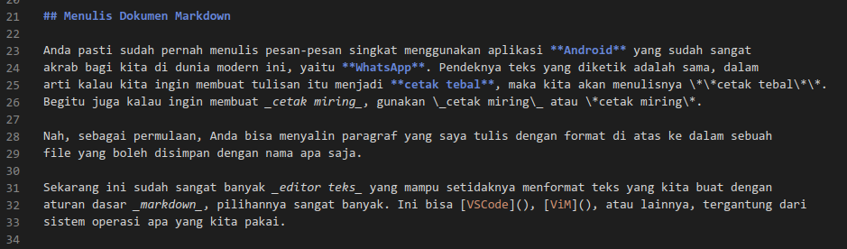

# W3.CSS dan Astro

Kita mulai dengan hal paling mudah dulu, menulis dokumen yang akan menjadi _konten_ kita, karena
di sini fokus kita adalah menulis konten, dan bukan berkutat dengan aneka macam _framework_ dan
platform, atau kode-kode pemrograman.

Kalaupun nantinya kita akan membahas mengenai kode pemrograman, ini bisa dipelajari sambil jalan,
dan yang akan dipelajari adalah seperlunya.

## Menulis Dokumen Markdown

Anda pasti sudah pernah menulis pesan-pesan singkat menggunakan aplikasi **Android** yang sudah sangat
akrab bagi kita di dunia modern ini, yaitu **WhatsApp**. Pendeknya teks yang diketik adalah sama, dalam
arti kalau kita ingin membuat tulisan itu menjadi **cetak tebal**, maka kita akan menulisnya \*\*cetak tebal\*\*.
Begitu juga kalau ingin membuat _cetak miring_, gunakan \_cetak miring\_ atau \*cetak miring\*.

Nah, sebagai permulaan, Anda bisa menyalin paragraf yang saya tulis dengan format di atas ke dalam sebuah
file yang boleh disimpan dengan nama apa saja.

Sekarang ini sudah sangat banyak _editor teks_ yang mampu setidaknya menformat teks yang kita buat dengan
aturan dasar _markdown_, pilihannya sangat banyak. Ini bisa [VSCode](), [ViM](), atau lainnya, tergantung dari
sistem operasi apa yang kita pakai.

Dalam VSCode, screenshot tulisan ini adalah sbb:

.

